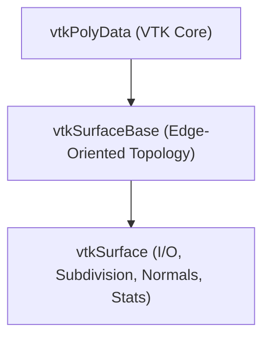
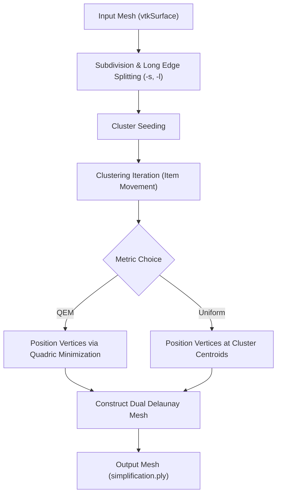

# ACVD Agentic Coding Guide (Single Master Reference)

Welcome to the **ACVD (Approximated Centroidal Voronoi Diagrams)** codebase. This is the single, unified master guide for AI agents (Antigravity, OpenCode, Cursor, Claude Code, GitHub Copilot, etc.) and human developers working on ACVD.

---

## 1. Codebase Overview & Architecture

ACVD is a C++ library and suite of command-line tools for 3D triangular mesh coarsening, remeshing, and volume processing built on **VTK (Visualization Toolkit)**.

### Directory Structure

```
ACVD/
├── Common/                      # Core mesh topology (vtkSurfaceBase, vtkSurface) & geometry utilities
│   ├── vtkSurfaceBase.{h,cxx}   # Base edge-oriented triangular mesh data structure
│   ├── vtkSurface.{h,cxx}       # Extended mesh class (I/O, areas, normals, subdivision)
│   ├── vtkCurvatureMeasure.*    # Discrete principal curvature calculations
│   ├── vtkQuadricTools.*        # Quadric error metric calculations
│   └── vtkVolumeProperties.*    # Volume computation from closed surfaces
├── DiscreteRemeshing/           # Voronoi discrete remeshing algorithms & clustering metrics
│   ├── vtkDiscreteRemeshing.h   # Abstract base class for Voronoi discrete remeshing
│   ├── vtkIsotropicDiscreteRemeshing.h # Isotropic surface remesher
│   ├── vtkQIsotropicDiscreteRemeshing.h # Quadric-enhanced remesher
│   ├── vtkAnisotropicDiscreteRemeshing.h # Anisotropic metric remesher
│   ├── vtkThreadedClustering.h  # OpenMP parallel clustering implementation
│   ├── vtk*MetricForClustering.h # Distance & error metrics (QEM, L21, Isotropic)
│   └── Examples/                # Remeshing executable entry points
│       ├── ACVD.cxx / ACVDP.cxx           # Main linear ACVD (sequential / parallel)
│       ├── ACVDQ.cxx / ACVDQP.cxx         # Quadric ACVD (sequential / parallel)
│       └── AnisotropicRemeshingQ.cxx      # Anisotropic remeshing
├── VolumeProcessing/            # Label image processing & out-of-core image readers
├── docs/                        # API & tool documentation (vtkSurface.md, other-programs.md)
├── scripts/                     # Agent verification script (agent_verify.sh)
├── Readme.md                    # Main documentation & CLI parameters reference
└── test.sh                      # Full test execution workflow script
```

---

## 2. Build, Testing & Verification Commands

### Prerequisites
- **CMake** 3.11+
- **VTK** 9.0+ (`libvtk9-dev` on Debian/Ubuntu)
- **GCC** 7+ / **Clang** 6+ with C++11 support
- **OpenMP** (Optional, for parallel executables)

### Build Commands
```bash
# Out-of-source release build
cmake -B build -DCMAKE_BUILD_TYPE=Release
cmake --build build -j$(nproc)

# Debug build (AddressSanitizer & symbols)
cmake -B build-debug -DCMAKE_BUILD_TYPE=Debug -DCMAKE_CXX_FLAGS="-fsanitize=address -g"
cmake --build build-debug -j$(nproc)
```

### Test Commands
```bash
# Run quick automated verification script
bash scripts/agent_verify.sh

# Run full repository test suite
bash test.sh
```

---

## 3. C++ Coding & VTK Memory Safety Rules

1. **VTK Object Memory Ownership**:
   - Always use VTK static factory instantiation: `vtkSurface* mesh = vtkSurface::New();` and call `mesh->Delete();` when done, OR use `vtkSmartPointer<vtkSurface> mesh = vtkSmartPointer<vtkSurface>::New();`.
   - **NEVER** use standard C++ `delete` on VTK objects derived from `vtkObjectBase`.

2. **Mesh Topology Integrity**:
   - When modifying mesh topology with `vtkSurfaceBase` (e.g. vertex collapse, face deletion), deleted element slots are marked dirty until `CleanMemory()` or `SQueeze()` is called.
   - Check edge valence (`GetValence`) and boundary status (`GetNumberOfBoundaries`) before performing edge operations.
   - Enable `SetManifoldEnforcement(1)` or CLI `-m 1` to guarantee a 2-manifold output mesh.

3. **Multi-Threading Safety (OpenMP)**:
   - Parallel classes (`ACVDP`, `ACVDQP`, `vtkThreadedClustering`) use OpenMP. Do not mutate shared VTK data structures within `#pragma omp parallel for` sections without proper reduction or locks.
   - Parallel remeshing executions are **non-deterministic**.

---

## 4. Deep-Dive: Mesh Data Structures (`vtkSurfaceBase` & `vtkSurface`)

### Architecture
`vtkSurfaceBase` extends VTK's `vtkPolyData` by providing an explicit edge-oriented representation with constant-time $O(1)$ topological adjacency queries:



### Key Data Structures
- **Vertices**: 3D coordinates $(x, y, z)$.
- **Edges**: Vertex pairs $(v_1, v_2)$ and adjacent face IDs $(f_1, f_2)$.
- **Faces**: Vertex triples $(v_1, v_2, v_3)$.
- **Ring Arrays**: Vertex-to-edge (`VertexNeighbourEdges`) and vertex-to-face (`VertexNeighbourFaces`) lists.

### $O(1)$ Adjacency Queries & Operations

```cpp
// 1. Get vertex ring neighbours
vtkSmartPointer<vtkIdList> neighbours = vtkSmartPointer<vtkIdList>::New();
surface->GetVertexNeighbours(v1, neighbours);

// 2. Get edge vertices & adjacent faces
vtkIdType v1, v2, f1, f2;
surface->GetEdgeVertices(edgeId, v1, v2);
surface->GetEdgeFaces(edgeId, f1, f2);

// 3. Topology operations
surface->FlipEdge(edgeId);          // Flip shared diagonal
surface->BisectEdge(edgeId);        // Bisect edge at midpoint
surface->MergeVertices(v1, v2);     // Collapse v2 into v1
surface->CleanMemory();             // Purge dirty deleted element slots
```

---

## 5. Deep-Dive: Remeshing Algorithms & Metrics

ACVD performs surface remeshing by partitioning the mesh into discrete Voronoi clusters, then constructing the dual Delaunay triangulation from cluster centroids:



### Clustering Metrics (`DiscreteRemeshing/`)
- **`vtkIsotropicMetricForClustering`**: Standard Euclidean metric for uniform isotropic triangles.
- **`vtkQEMetricForClustering`**: Quadric Error Metric (QEM) preserving sharp feature edges and corners (`ACVDQ`).
- **`vtkAnisotropicMetricForClustering`**: Tensor-based metric aligned with principal curvature directions (`AnisotropicRemeshing`).
- **`vtkL21MetricForClustering`**: Normal-variation minimization metric.

---

## 6. CLI Parameters Reference

Common invocation pattern:
```bash
./build/bin/ACVD <input_mesh> <n_vertices> <curvature_weight> [options]
```

- `<input_mesh>`: Path to input 3D model (`.ply`, `.obj`, `.vtk`, `.off`, `.wrl`, `.stl`).
- `<n_vertices>`: Desired number of vertices in output mesh.
- `<curvature_weight>`: Curvature gradation weight (`0.0` = uniform density, `1.5` = dense sampling in high-curvature regions).
- `-s <ratio>`: Subsampling threshold ratio (default `10`; set `-s 100` for high quality).
- `-l <ratio>`: Edge splitting ratio (`-l 3` pre-splits edges longer than $3 \times \text{average\_length}$).
- `-m <0|1>`: Enforce 2-manifold output topology (`1` = enabled, `0` = disabled).
- `-d <0|1|2>`: Visualization level (`0` = silent, `1` = final window, `2` = step-by-step iteration display).
- `-np <num_threads>`: Specify number of OpenMP threads for parallel executables (`ACVDP`, `ACVDQP`).
- `-o <output_filename>`: Custom output PLY filename (default is `simplification.ply`).

---

## 7. Related Documentation

- **[Readme.md](Readme.md)**: Main user documentation & usage examples.
- **[docs/vtkSurface.md](docs/vtkSurface.md)**: `vtkSurface` / `vtkSurfaceBase` detailed API reference.
- **[docs/other-programs.md](docs/other-programs.md)**: Auxiliary programs (`VolumeAnalysis`, `ManifoldSimplification`, mesh converters).
